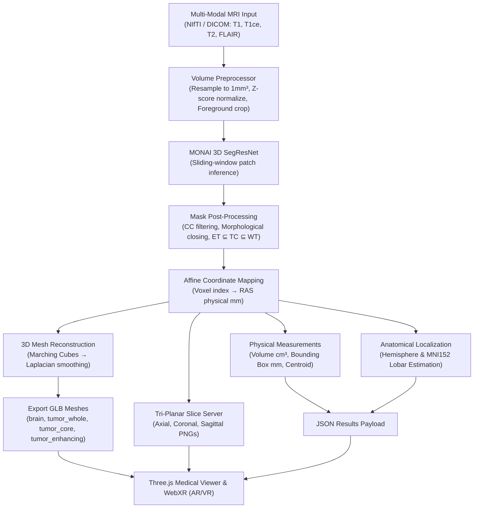

# NeuroVR 3D

<div align="center">

### AI-Powered Volumetric Brain MRI Segmentation · Anatomical Localization · WebXR AR/VR Visualization

[](https://www.python.org/downloads/)
[](https://pytorch.org/)
[](https://monai.io/)
[](https://threejs.org/)
[](https://immersiveweb.dev/)
[](tests/)
[](LICENSE)

</div>

> [!CAUTION]
> **RESEARCH PROTOTYPE — NOT FOR CLINICAL DIAGNOSIS OR SURGICAL GUIDANCE.**  
> NeuroVR 3D is an educational and research prototype. All segmentation outputs, volumetric measurements, and anatomical localization estimates are machine-generated approximations and must **not** be used for primary patient diagnosis, surgical guidance, or clinical decision-making. Always consult a board-certified neuroradiologist and neurosurgeon.

---

## 📖 Overview

**NeuroVR 3D** is an end-to-end medical imaging and computer vision platform designed for volumetric brain tumor analysis. It bridges deep learning segmentation models with immersive WebXR visualization, enabling interactive spatial exploration of brain lesions.

### Core Capabilities

- **Multi-Modal Ingestion**: Handles multi-parametric NIfTI (`.nii`, `.nii.gz`) and DICOM series across 4 modalities: **T1**, **T1ce (Contrast-Enhanced)**, **T2**, and **FLAIR**.
- **Deep Volumetric Segmentation**: Utilizes a pretrained MONAI SegResNet model (trained on the BraTS challenge) for sliding-window 3D segmentation.
- **Strict Biological Sub-Region Hierarchy**: Guarantees pathological containment ($\text{Enhancing Tumor} \subseteq \text{Tumor Core} \subseteq \text{Whole Tumor}$) through connected-component analysis and morphological closing.
- **True World-Space Alignment**: Preserves the native NIfTI affine transformation matrix throughout Marching Cubes surface extraction, ensuring sub-millimeter co-registration between the brain cortical surface and tumor sub-regions.
- **Physical Quantifications**: Calculates exact physical volumes in cubic centimeters ($\text{cm}^3$), 3D bounding boxes in millimeters ($\text{mm}$), and center-of-mass centroids in RAS coordinate space.
- **Anatomical Localization**: Maps tumor centroids into standard neurological coordinate frames (Left/Right hemisphere, Midline, and MNI152-referenced lobar regions).
- **Tri-Planar Orthogonal Slicing**: Generates real-time 2D cross-sectional slice inspections across Axial, Coronal, and Sagittal planes.
- **Interactive 3D Medical Workstation**: High-performance browser viewport rendered via Three.js with PBR shaders, independent layer toggles, transparency controls, and cross-section clipping planes.
- **WebXR AR & VR**: Zero-install immersive inspection—place 3D holograms in physical space (AR via ARCore/ARKit) or walk inside 3D volumes using VR head-mounted displays.

---

## 🔄 Pipeline Architecture



---

## ⚡ Quick Start

### 1. Prerequisites

- Python 3.9+ (Python 3.9 – 3.11 recommended)
- Modern web browser with WebGL 2.0 support (Chrome, Edge, Safari, Firefox)

### 2. Installation

Clone the repository and install the Python dependencies:

```bash
git clone https://github.com/Saisuman55/NeuroVR.git
cd NeuroVR
pip install -r requirements.txt
```

### 3. Verify or Download MONAI Model Weights

Verify that the pretrained MONAI BraTS model weights exist in `models/`:

```bash
ls -la models/monai/brats_mri_segmentation/models/model.pt
```

If missing, run the automated bundle downloader:

```bash
python3 scripts/download_bundle.py
```

### 4. Launch the Server

#### On macOS (Apple Silicon / Intel):
```bash
DISABLE_MPS=1 PYTORCH_ENABLE_MPS_FALLBACK=1 python3 flask_app_3d.py
```
*(PyTorch Metal initialization is warmed up on the main thread to prevent MPS lock deadlocks during background inference).*

#### On Linux / Windows (with NVIDIA CUDA):
```bash
python3 flask_app_3d.py
```

Open your browser to: **[http://localhost:7861](http://localhost:7861)**

### 5. Instant Demonstration Mode

Click the **⚗ Load Demo** button on the top toolbar. This executes the entire pipeline using the bundled standard MNI152 human brain scan (`data/real_brats/`) and demonstrates full volumetric segmentation, mesh generation, measurement calculation, and 3D rendering in seconds.

---

## 📁 Repository Structure

```
brain_tumor_project/
│
├── flask_app_3d.py                 # Primary Flask REST API & static server (Port 7861)
├── config.yaml                     # Application hyperparameters & threshold configs
├── requirements.txt                # Python package dependencies
├── .env.example                    # Environment variable template
├── NEUROVR_3D_TEST_REPORT.md       # Comprehensive validation and test report
│
├── preprocessing/                  # Medical image parsing & normalization
│   ├── nifti_loader.py             # Multi-modal NIfTI loading & affine extraction
│   ├── dicom_loader.py             # DICOM directory scanning & volumetric stacking
│   └── volume_preprocessor.py      # Resampling (1mm³), min-max/z-score normalization
│
├── inference/                      # Deep learning inference & anatomical mapping
│   ├── model_loader_3d.py          # TorchScript & MONAI model deserialization
│   ├── segmentation_3d.py          # Sliding-window 3D segmentation engine
│   ├── segmentation_numpy.py       # Deterministic CPU fallback engine
│   └── localization.py             # RAS coordinate transformation & MNI152 lobar mapping
│
├── reconstruction/                 # 3D surface extraction & physical metrics
│   ├── tumor_mesh.py               # Marching Cubes with affine transforms → GLB export
│   ├── mask_processing.py         # Connected component filtering & hierarchical containment
│   └── measurements.py             # Volume (cm³), bounding box (mm), and centroid calculations
│
├── frontend/                       # Interactive Medical Workstation UI
│   ├── index.html                  # Semantic workstation layout & Three.js importmap
│   ├── style.css                   # Cyber-clinical dark theme design system
│   ├── viewer.js                   # Three.js viewport, OrbitControls, clipping planes, WebXR
│   └── ui.js                       # Session management, status polling, results formatting
│
├── training/                       # Model training & fine-tuning pipelines
│   ├── README.md                   # Training guidelines & benchmark metrics
│   ├── train_2d_classifier.py     # EfficientNet-B0 classifier (Figshare CE-MRI)
│   └── train_3d_segmentation.py   # SegResNet fine-tuning (MSD Task01 / BraTS)
│
├── models/                         # Model weights and MONAI bundle specifications
│   ├── README.md
│   └── monai/brats_mri_segmentation/   # Pretrained SegResNet weights (model.pt / model.ts)
│
├── data/
│   └── real_brats/                 # Bundled MNI152 demo MRI dataset (~3.4 MB)
│
├── demo_data/
│   └── generate_demo.py            # Synthetic anatomical BraTS case generator
│
└── tests/                          # Automated testing suite
    ├── smoke_test.py               # End-to-end pipeline smoke test
    └── test_pipeline.py            # 24 unit and regression tests
```

---

## 🔌 REST API Reference

| Method | Endpoint | Description |
|---|---|---|
| `GET` | `/api/health` | Service status, active compute device (CPU/CUDA), and version info |
| `GET` | `/api/demo` | Trigger demonstration analysis pipeline using bundled standard MRI |
| `POST` | `/api/upload` | Upload multi-modal NIfTI files (`multipart/form-data`) |
| `POST` | `/api/analyze/<session_id>` | Start 3D AI segmentation pipeline for uploaded session |
| `GET` | `/api/status/<session_id>` | Poll processing status (`queued`, `running`, `complete`, `failed`) and progress % |
| `GET` | `/api/results/<session_id>` | Physical measurements (volumes, bounding boxes, centroids) and status |
| `GET` | `/api/localization/<session_id>` | Anatomical localization (hemisphere, coordinates, estimated lobe) |
| `GET` | `/api/mesh/<session_id>/<mesh_type>` | Download GLB mesh (`brain`, `tumor_whole`, `tumor_core`, `tumor_enhancing`) |
| `GET` | `/api/slice_info/<session_id>` | Slice dimension limits for Axial, Coronal, and Sagittal planes |
| `GET` | `/api/slice/<session_id>/<plane>/<idx>` | Serve 2D MRI slice visualization as PNG image |
| `DELETE` | `/api/session/<session_id>` | Purge session files and temporary memory caches |

---

## 🔬 Model Specifications & Biological Hierarchy

NeuroVR 3D implements the **BraTS (Brain Tumor Segmentation)** labeling convention:

| Sub-Region | Label Code | Clinical Meaning | Color Code |
|---|:---:|---|:---:|
| **Enhancing Tumor (ET)** | 4 | Hyper-intense gadolinium-enhancing viable tumor tissue | Yellow / Coral |
| **Tumor Core (TC)** | 1 + 4 | Necrotic core + active enhancing components | Cyan / Amber |
| **Whole Tumor (WT)** | 1 + 2 + 4 | Entire lesion: Necrotic core + Enhancing + Peritumoral edema | Crimson / Red |
| **Brain Shell** | — | Cortical anatomical reference surface | Ghost White (Translucent) |

### Mathematical Invariants
Biological tumor physiology dictates that an enhancing region cannot exist outside the necrotic/enhancing core, nor can the core exist outside the complete pathological lesion:
$$\text{Enhancing Tumor} \subseteq \text{Tumor Core} \subseteq \text{Whole Tumor}$$

Our post-processing pipeline ([`reconstruction/mask_processing.py`](reconstruction/mask_processing.py)) strictly enforces this hierarchy:
1. Small noise components ($< 50\text{ voxels}$) are filtered via connected-component labeling.
2. Binary morphological closing repairs surface cavities.
3. Hierarchical masking enforces $ET = ET \cap TC$ and $TC = TC \cap WT$.

---

## 🏋️ Model Training & Fine-Tuning

Training scripts are organized in [`training/`](training/):

### 1. 2D Classification (`training/train_2d_classifier.py`)
- **Architecture**: EfficientNet-B0 with custom classification head.
- **Dataset**: Figshare Cheng CE-MRI dataset (glioma, meningioma, pituitary).
- **Split**: Patient-separated, deterministic 80/20 train/validation split.
- **Usage**:
  ```bash
  python3 training/train_2d_classifier.py --data_dir data/training/figshare --epochs 20
  ```

### 2. 3D Volumetric Segmentation (`training/train_3d_segmentation.py`)
- **Architecture**: MONAI SegResNet.
- **Dataset**: Medical Segmentation Decathlon (MSD Task01_BrainTumour) / BraTS multi-parametric scans.
- **Loss Function**: Combined Dice + Cross-Entropy Loss on 4-channel input volumes.
- **Usage**:
  ```bash
  python3 training/train_3d_segmentation.py --data_dir data/training/msd_task01 --epochs 20
  ```

---

## 👓 WebXR: Augmented & Virtual Reality

NeuroVR 3D features native WebXR support:
- **Augmented Reality (AR)**: Place the life-sized 3D brain model on a surgical tray, desk, or patient bed for pre-operative spatial briefing using an AR-capable device (Android ARCore / iOS WebXR Viewer).
- **Virtual Reality (VR)**: Enter a fully immersive darkroom simulation using standard PCVR or standalone headsets (Meta Quest, HTC Vive, Apple Vision Pro).

> **Note**: WebXR requires an `https://` secure context in production. `localhost` is treated as a secure origin by Chromium-based browsers for development.

---

## 🧪 Testing & Verification

NeuroVR 3D includes comprehensive test coverage:

```bash
# Run the complete automated PyTest test suite (24 tests)
python3 -m pytest tests/

# Run the end-to-end pipeline smoke test
python3 tests/smoke_test.py
```

Detailed test logs and verification records can be found in [NEUROVR_3D_TEST_REPORT.md](NEUROVR_3D_TEST_REPORT.md).

---

## 🔒 Privacy & HIPAA Notice

- Uploaded MRI series are written to ephemeral session directories (`outputs/<session_id>/`).
- Active sessions and voxel caches are held in volatile process memory and purged on server termination.
- De-identification / DICOM anonymization should always be performed prior to uploading data outside a HIPAA-compliant infrastructure.
- No real patient data is stored or tracked in this Git repository.

---

## 📄 License

- Application source code: [MIT License](LICENSE)
- MONAI BraTS Segmentation Model: [Apache 2.0](models/monai/brats_mri_segmentation/LICENSE)
- Three.js: [MIT License](https://github.com/mrdoob/three.js/blob/dev/LICENSE)
